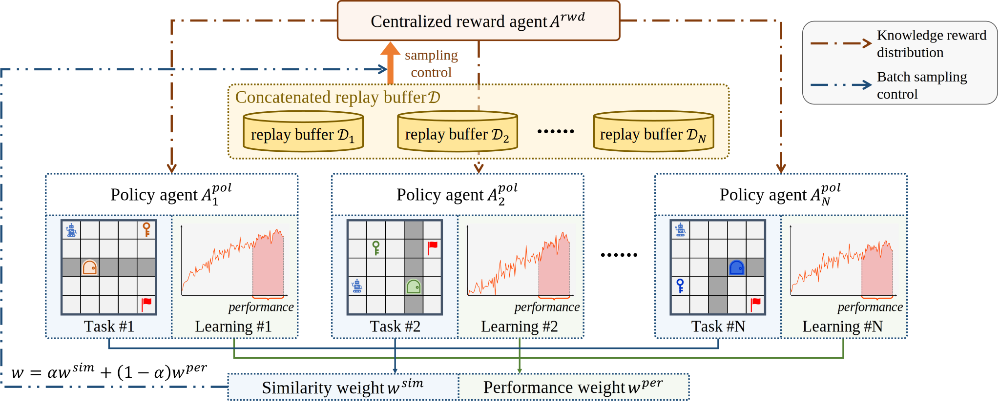
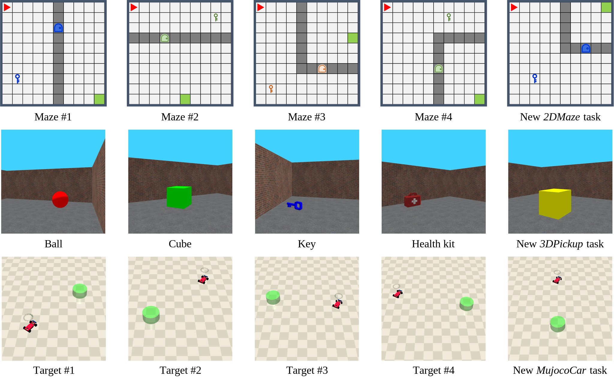
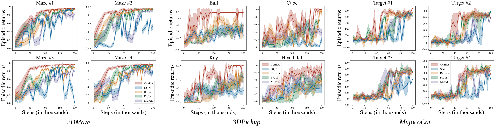

# Knowledge Sharing and Transfer via Centralized Reward Agent for Multi-Task Reinforcement Learning

The codes for the **Cen**tralized **R**eward **A**gent (CenRA) framework of MTRL. 

[[Paper link]()]

CenRA consists of two components: one centralized reward agent (CRA) and multiple distributed policy agents for their corresponding tasks. The CRA is responsible for learning a reward model to share and transfer task-relevant knowledge to the policy agents. 



## Requirements

- The code is only supported for Python 3.6 to 3.10. (Due to the PyBullet rendering package, the code is **not supported** for Python higher than 3.11.)
- This code has been tested on:
```
pytorch==2.0.1+cu117
```
- Install all dependent packages:
```
pip3 install -r requirements.txt
```
- For the *MujocoCar* environment, refer to [this instruction](./RLEnvs/SafetyGynmasium/README.md) for detailed installation.

## Run CenRA Algorithm

Run the following command to train CenRA on different environments specified by `<Environment>`:

```
python run-<Environment>.py
```

All available environments with corresponding `<Environment>` are listed below:
* *2DMaze* environment: `2dmaze`, [running script](./run-2dmaze.py).
* *3DPickup* environment: `3dpickup`, [running script](./run-3dpickup.py).
* *MujocoCar* environment: `mujococar`, [running script](./run-mujococar.py).




All hyper-parameters are set as default values in the code. You can change them by adding arguments to the command line. Some selected available arguments are listed below, for the full list, please refer to the running scripts `run-<Environment>.py`.

```
--exp-name: the name of the experiment, to record the tensorboard and save the model.

--suggested-reward-scale: the scale of the knowledge reward, default is 1.
--lamb: the weight of the knowledge reward, default is 0.5.

--total-timesteps: the total timesteps to train the agent.
--pa-learning-starts: the burn-in steps of the distributed policy agent.
--ra-learning-starts: the burn-in steps of the centralized reward agent.

--pa-buffer-size: the buffer size of the policy agent.
--pa-batch-size: the batch size of the policy agent
--ra-batch-size: the batch size of the reward agent
```

## Comparative Evaluation

The comparison of CenRA with several baselines, including the backbone algorithms [DQN](https://www.nature.com/articles/nature14236) (Mnih et al. 2015) for discrete control and [SAC](https://proceedings.mlr.press/v80/haarnoja18b) (Haarnojaet al. 2018) for continuous control, [ReLara](https://proceedings.mlr.press/v235/ma24l.html) (Ma et al. 2024), [PiCor](https://ojs.aaai.org/index.php/AAAI/article/view/25825) (Bai et al. 2023) and [MCAL](https://openreview.net/forum?id=rJvY_5OzoI) (Mysore et al. 2022). 

